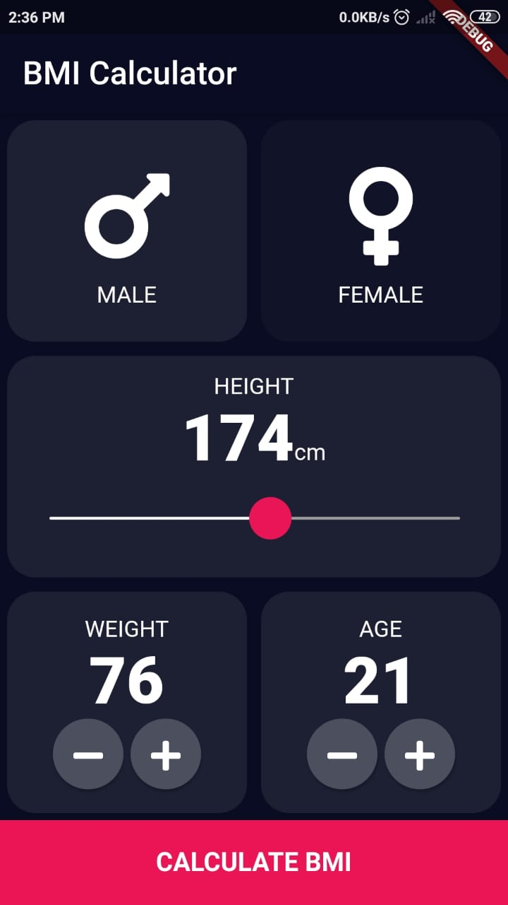
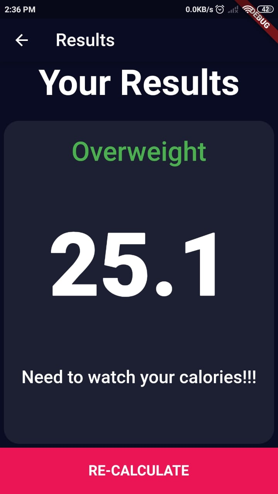

# BMI Calculator
This app is a BMI Calculator. I worked on this application in order to enhance my User Interface Design skills and to familiarize with the UI elements offered by flutter. As far as the working of the app is concerned, It takes in the body size metrics of the user into account to calculate the BMI. Along with the BMI-index, It also shows the category that a user fits in and a suggestion for the user based on the user BMI-index.

<pre>                                 </pre>

